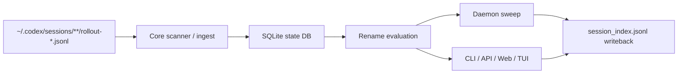

# CodexNamer

[English](README.md) | [简体中文](README.zh.md)

Local-first session naming and automation for Codex rollouts.

CodexNamer scans local rollout files under `~/.codex/sessions/**/rollout-*.jsonl`, keeps its own SQLite state database, and writes final names back through `~/.codex/session_index.jsonl` — without patching Codex itself or touching Codex's internal SQLite.


## Why this exists

Codex already stores session history locally, but day-to-day session management quickly becomes messy when you have:

- hundreds of rollout files
- weak or stale default titles
- multiple workspaces and providers
- a need to batch rename, freeze, replay, or audit naming history
- a desire to auto-apply stable names only when sessions are truly idle

This project adds an external management layer on top of Codex's local data model:

- **read** local rollout files
- **derive** structured names from heuristics or AI
- **preview** rename decisions before applying
- **write back** through the official `session_index.jsonl` rename layer

## Highlights

- **No Codex patching required**  
  Works as a standalone local tool. It does not wrap Codex startup and does not modify Codex source code.

- **Local-first and auditable**  
  Reads rollout files, stores derived state in its own SQLite database, and keeps rename history separate from Codex internals.

- **Structured AI naming**  
  Supports structured naming with `tag / kind / scope / summary` composition, prompt preview, context strategies, and per-session style overrides.

- **Multiple operators, one backend**  
  CLI, Local API, Web UI, TUI, and daemon all share the same core rename engine and state model.

- **Safe auto-apply model**  
  Distinguishes between preview status (`skip / suggest / apply`) and real writeback execution (`preview-only` vs `auto-apply`).

- **Daemon control in Web UI**  
  The Web app can start and stop the sweep daemon manually instead of requiring a boot-persistent service.

- **Practical queue operations**  
  Freeze, manual override, replay renames, detect name collisions, compact `session_index.jsonl`, inspect provider diagnostics, and review AI request logs.

## Architecture



## Feature overview

| Capability | Status | Entry points |
| --- | --- | --- |
| Rollout scanning and incremental ingest | Available | core |
| Structured rename candidate generation | Available | core / CLI / API / Web / TUI |
| Manual rename, freeze, manual override | Available | CLI / API / Web / TUI |
| Dirty queue preview and batch apply | Available | CLI / API / Web / TUI |
| Auto-rename sweep with daemon heartbeat | Available | daemon / API / Web |
| Provider diagnostics and prompt preview | Available | CLI / API / Web / TUI |
| `session_index.jsonl` compaction | Available | CLI / API / Web |
| Daemon start/stop from Web UI | Available | API / Web |

## Quick start

### Requirements

- Node.js `20+`
- npm `10+`
- A local Codex home directory, usually `~/.codex`
- If you want AI naming via inherited Codex provider settings:
  - `~/.codex/config.toml`
  - `~/.codex/auth.json`

### Install

```bash
git clone <your-repo-url> codexnamer
cd codexnamer
npm install
npm run build
```

### Start the Web app

```bash
npm run web
```

The launcher will:

- reuse a healthy local API if one already exists
- or start a new API on an available `42110+` port
- clean up stale repo-owned launcher/API/web dev processes
- open the Vite app against the matching API target

Default Web URL:

- `http://127.0.0.1:43110`

### Start the TUI

```bash
npm run tui
```

Or connect the TUI to an explicit API:

```bash
npm run tui -- --api-base http://127.0.0.1:42110
```

### Start the Local API directly

```bash
npm run api -- --host 127.0.0.1 --port 42110
curl http://127.0.0.1:42110/api/v1/health
```

### Start the daemon

```bash
# Continuous sweep
npm run daemon

# Single sweep only
npm run daemon -- --once

# Custom interval
npm run daemon -- --interval 60
```

## Auto-apply semantics

This project intentionally separates **rename evaluation** from **actual writeback**.

- `skip` → do nothing
- `suggest` → candidate is ready for preview
- `apply` → candidate is eligible to be written

But `apply` in preview does **not** automatically mean the rename was written back.

Real auto-apply depends on runtime state:

- `rename.auto_apply = "disabled"` → preview only
- `rename.auto_apply = "idle-finalize"` + daemon running → eligible `finalize_ready` sessions can be written automatically

The UI exposes:

- configured auto-apply policy
- actual execution mode
- daemon heartbeat status
- last sweep summary

So you can distinguish "configured for auto-apply" from "actually applying now".

## Configuration

Default config path:

- `~/.config/codexnamer/config.toml`

> Note: the default config and state paths now use the **CodexNamer** prefix. If you already have legacy `codex-session-manager` config or state directories, the loader still reads them for compatibility.

Minimal example:

```toml
[general]
codex_home = "~/.codex"
state_dir = "~/.local/state/codexnamer"
ui_language = "zh-CN"

[ai]
backend = "responses"
provider_source = "codex-config"
profile = "default"
max_concurrency = 1

[naming]
preset = "conventional"
language = "zh-CN"
context_strategy = "summary-signals"
context_max_chars = 8000
composition_mode = "structured"
builder = [
  { type = "component", component = "tag" },
  { type = "separator", value = " · " },
  { type = "component", component = "kind" },
  { type = "separator", value = " · " },
  { type = "component", component = "summary" }
]

[[naming.tags]]
id = "settings"
description = "Settings, provider, config, save, and language related sessions."
prompt_hint = "setting settings config save language provider"
```

## Selected commands

### CLI

```bash
npm run cli -- list --dirty
npm run cli -- show --id <thread-id>
npm run cli -- suggest --id <thread-id>
npm run cli -- apply --id <thread-id>
npm run cli -- rename --id <thread-id> --name "feat(api): add config writeback"
npm run cli -- batch apply --dirty --preview
npm run cli -- batch apply --dirty
npm run cli -- compact-index --dry-run
npm run cli -- doctor
npm run cli -- provider test
```

### Local API

```bash
curl 'http://127.0.0.1:42110/api/v1/sessions?dirty=true&search=api'
curl -X POST http://127.0.0.1:42110/api/v1/sessions/<thread-id>/suggest
curl -X POST http://127.0.0.1:42110/api/v1/sessions/<thread-id>/apply
curl http://127.0.0.1:42110/api/v1/overview
curl http://127.0.0.1:42110/api/v1/daemon
```

## Repo layout

```text
packages/core     core ingest, state, provider, naming, writeback
packages/shared   shared DTOs and schemas
packages/api      local Fastify API
packages/cli      CLI entry point
packages/daemon   sweep daemon
packages/web      React + Vite dashboard
packages/tui      Ink-based terminal UI
docs/             specs, ADRs, design notes, reviews
test/             Vitest test suite
```

## Development

```bash
npm install
npm run build
npm run build:runtime
npm run web:build
npm test
```

Useful local entry points:

```bash
npm run web
npm run tui
npm run api
npm run daemon
```

## Documentation

- [Documentation index](docs/README.md)
- [Repo overview](docs/spec/repo-overview.md)
- [System design](docs/spec/system-design.md)
- [Config and AI backend](docs/spec/config-and-ai.md)
- [Web / TUI / Local API design](docs/spec/web-tui-local-api-design.md)
- [Rename evaluation and context](docs/spec/rename-evaluation-and-context.md)

## Project status

This repository is already usable for local session management, but it is still early-stage software.

Current strengths:

- the core read/write loop is implemented
- the Web UI, TUI, CLI, API, and daemon are all functional
- naming, provider diagnostics, and maintenance flows are test-covered

Still evolving:

- release packaging and distribution
- long-term compatibility hardening against future Codex data model changes
- public project polish, docs, and contributor workflows

## Contributing

See [CONTRIBUTING.md](CONTRIBUTING.md).

## Security

See [SECURITY.md](SECURITY.md).

## License

MIT — see [LICENSE](LICENSE).
