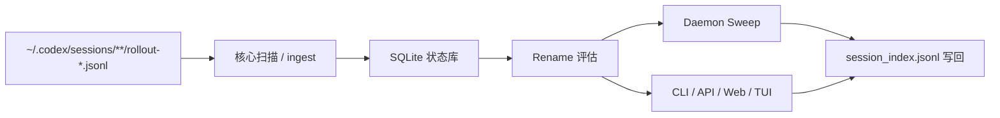

# CodexNamer

[English](README.md) | [简体中文](README.zh.md)

一个面向 Codex rollout 的本地优先 session 命名与自动化管理工具。

它会扫描 `~/.codex/sessions/**/rollout-*.jsonl`，维护自己的 SQLite 状态库，再通过 `~/.codex/session_index.jsonl` 把最终标题写回去——不修改 Codex 源码，也不碰 Codex 内部 SQLite。


## 这个项目解决什么问题

Codex 的本地 rollout 数据很有价值，但当 session 数量上来以后，很容易遇到这些问题：

- rollout 文件很多，默认标题越来越难找
- 同时有多个 workspace / provider / model
- 想批量 rename、冻结、重放历史命名
- 想自动命名，但又不想“会话一有变化就立刻改名”

这个项目做的事情是：

- **读取** 本地 rollout 文件
- **理解** session 状态并生成结构化候选标题
- **预览** `skip / suggest / apply`
- **写回** 官方 `session_index.jsonl` rename 层

## 核心特性

- **不需要 patch Codex**  
  完全独立运行，不接管 Codex 启动，也不改 Codex 源码。

- **本地优先、可审计**  
  rollout 原文、项目自身状态库、rename 历史三层分开，方便追踪问题。

- **结构化 AI 命名**  
  支持 `tag / kind / scope / summary` 组件式命名、Prompt Preview、context 策略和单会话风格切换。

- **多入口共享一套后端**  
  CLI、Local API、Web UI、TUI、daemon 都复用同一套核心 rename 引擎。

- **自动应用语义清晰**  
  UI 会明确区分“允许应用”和“已经真正自动写回”。

- **Web 里可以启停 daemon**  
  不要求开机常驻服务，直接在 Web 里手动启动 / 停止 sweep daemon。

- **运维能力完整**  
  支持 freeze、manual override、rename replay、重名规避、provider diagnostics、AI 请求日志、`session_index.jsonl` compact。

## 架构概览



## 功能总览

| 能力 | 当前状态 | 入口 |
| --- | --- | --- |
| rollout 扫描与增量 ingest | 已可用 | core |
| 结构化标题生成 | 已可用 | core / CLI / API / Web / TUI |
| 手动 rename / freeze / manual override | 已可用 | CLI / API / Web / TUI |
| dirty 队列预览与批量 apply | 已可用 | CLI / API / Web / TUI |
| 带 heartbeat 的 daemon sweep | 已可用 | daemon / API / Web |
| provider diagnostics / prompt preview | 已可用 | CLI / API / Web / TUI |
| `session_index.jsonl` compact | 已可用 | CLI / API / Web |
| Web 里手动启停 daemon | 已可用 | API / Web |

## 快速开始

### 前置要求

- Node.js `20+`
- npm `10+`
- 本地已有 Codex 目录，通常是 `~/.codex`
- 如果要继承 Codex 的 provider 配置，需要：
  - `~/.codex/config.toml`
  - `~/.codex/auth.json`

### 安装

```bash
git clone <your-repo-url> codexnamer
cd codexnamer
npm install
npm run build
```

### 启动 Web

```bash
npm run web
```

这个启动器会自动：

- 复用一个健康的本地 API
- 或在 `42110+` 范围内启动新的 API
- 清理当前 repo 里残留的旧 launcher / API / Web dev 进程
- 让 Vite 自动指向正确的 API

默认地址：

- `http://127.0.0.1:43110`

### 启动 TUI

```bash
npm run tui
```

如果你想显式连到一个已有 API：

```bash
npm run tui -- --api-base http://127.0.0.1:42110
```

### 单独启动 Local API

```bash
npm run api -- --host 127.0.0.1 --port 42110
curl http://127.0.0.1:42110/api/v1/health
```

### 启动 daemon

```bash
# 持续运行
npm run daemon

# 只跑一轮
npm run daemon -- --once

# 自定义间隔
npm run daemon -- --interval 60
```

## 自动应用语义

这里会明确区分“评估结果”和“真实写回”：

- `skip`：跳过
- `suggest`：候选名已准备好，适合预览
- `apply`：满足落盘条件，可以被真正写回

但 UI 里看到 `apply`，并不代表已经自动写回。

真正是否会自动应用，要看运行态：

- `rename.auto_apply = "disabled"`：只做 preview
- `rename.auto_apply = "idle-finalize"` 且 daemon 正在运行：命中的 `finalize_ready` 才会自动写回

界面会同时展示：

- 当前配置的 auto-apply 策略
- 实际执行态
- daemon heartbeat 状态
- 最近一轮 sweep 摘要

这样就能分清“配置里开了自动应用”和“现在真的在自动应用”。

## 配置

默认配置路径：

- `~/.config/codex-session-manager/config.toml`

> 说明：公开项目名现在使用 **CodexNamer**，但当前默认本地配置 / 状态路径为了兼容，仍然保留历史上的 `codex-session-manager` 前缀。

最小示例：

```toml
[general]
codex_home = "~/.codex"
state_dir = "~/.local/state/codex-session-manager"
ui_language = "zh-CN"

[ai]
backend = "codex"
provider_source = "inherit-codex"
profile = "default"
max_concurrency = 1

[naming]
language = "zh-CN"
default_style = "detailed"
context_strategy = "summary-signals"
context_max_chars = 8000
composition_mode = "structured"
builder = [
  { type = "component", component = "tag" },
  { type = "separator", value = " · " },
  { type = "component", component = "kind" },
  { type = "separator", value = " · " },
  { type = "component", component = "summary" }
]

[[naming.tags]]
id = "settings"
description = "配置、保存、语言、provider 相关会话。"
prompt_hint = "setting settings config save language provider"
```

## 常用命令

### CLI

```bash
npm run cli -- list --dirty
npm run cli -- show --id <thread-id>
npm run cli -- suggest --id <thread-id>
npm run cli -- apply --id <thread-id>
npm run cli -- rename --id <thread-id> --name "feat(api): add config writeback"
npm run cli -- batch apply --dirty --preview
npm run cli -- batch apply --dirty
npm run cli -- compact-index --dry-run
npm run cli -- doctor
npm run cli -- provider test
```

### Local API

```bash
curl 'http://127.0.0.1:42110/api/v1/sessions?dirty=true&search=api'
curl -X POST http://127.0.0.1:42110/api/v1/sessions/<thread-id>/suggest
curl -X POST http://127.0.0.1:42110/api/v1/sessions/<thread-id>/apply
curl http://127.0.0.1:42110/api/v1/overview
curl http://127.0.0.1:42110/api/v1/daemon
```

## 仓库结构

```text
packages/core     核心 ingest / state / provider / naming / 写回
packages/shared   共享 DTO 与 schema
packages/api      本地 Fastify API
packages/cli      CLI 入口
packages/daemon   sweep daemon
packages/web      React + Vite 仪表盘
packages/tui      Ink 终端界面
docs/             规格、ADR、设计说明、审查记录
test/             Vitest 测试
```

## 开发

```bash
npm install
npm run build
npm run build:runtime
npm run web:build
npm test
```

常用本地入口：

```bash
npm run web
npm run tui
npm run api
npm run daemon
```

## 文档

- [文档总览](docs/README.md)
- [仓库总览](docs/spec/repo-overview.md)
- [系统设计](docs/spec/system-design.md)
- [配置与 AI 后端](docs/spec/config-and-ai.md)
- [Web / TUI / Local API 设计](docs/spec/web-tui-local-api-design.md)
- [Rename 评估与 Context 构建](docs/spec/rename-evaluation-and-context.md)

## 当前状态

这个仓库已经可以用于日常本地 session 管理，但仍然属于早期版本。

已经比较稳定的部分：

- 核心读写链路已经打通
- Web UI、TUI、CLI、API、daemon 都可用
- 命名、provider diagnostics、维护流程已有测试覆盖

还会继续演进的部分：

- 发布和分发方式
- 对未来 Codex 数据结构变化的兼容性加固
- 面向公开仓库的文档和贡献流程完善

## 贡献

见 [CONTRIBUTING.md](CONTRIBUTING.md)。

## 安全

见 [SECURITY.md](SECURITY.md)。

## 许可证

MIT，见 [LICENSE](LICENSE)。
