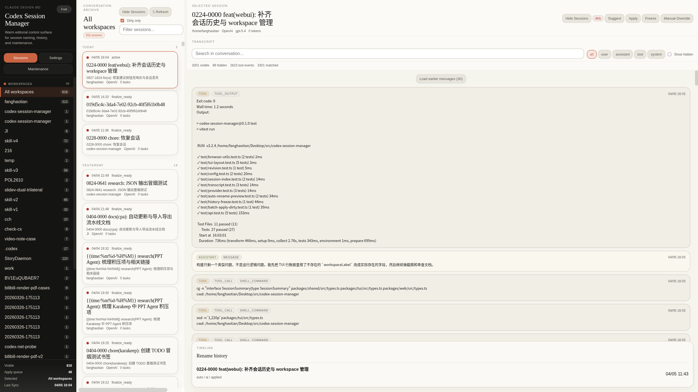
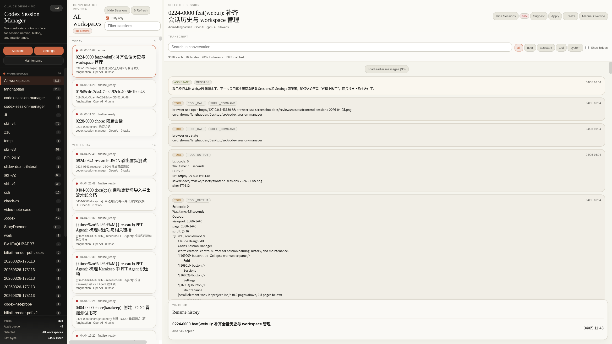
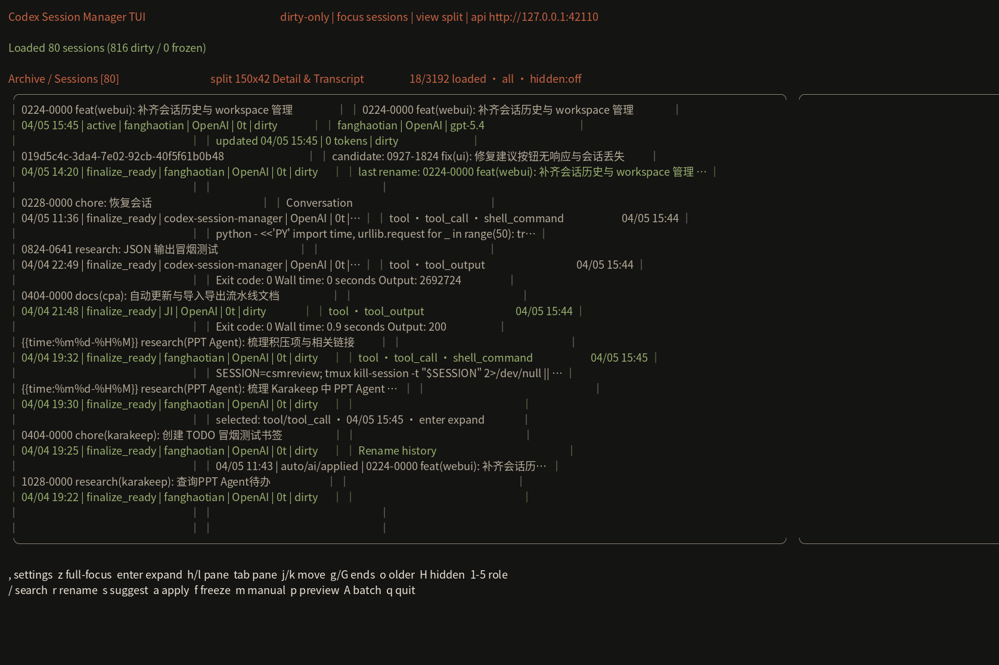
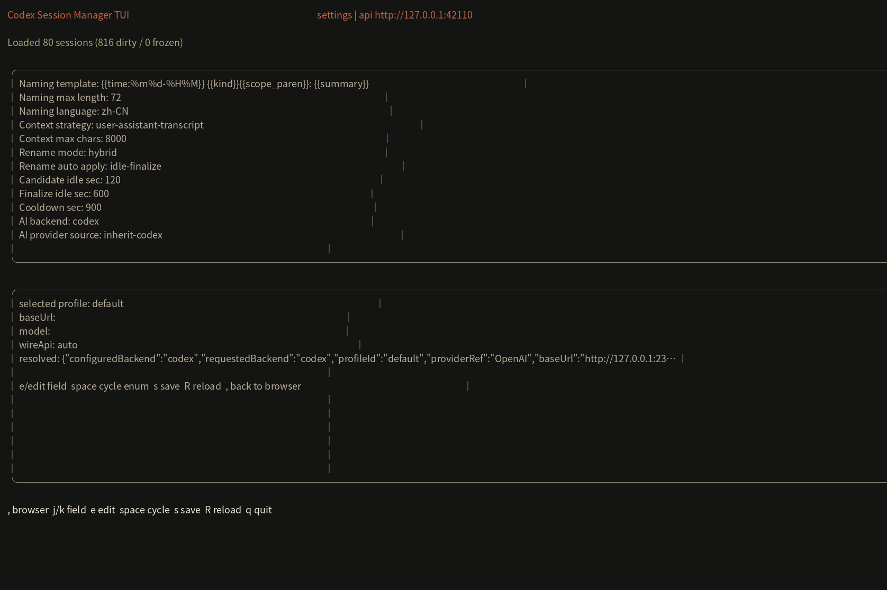

# Frontend Design Audit

Date: 2026-04-05

Scope:
- Web sessions browser
- Web settings surface
- TUI browser
- TUI settings

Reference target:
- `docs/design/claude/DESIGN.md`

Screenshot set:
- `docs/reviews/assets/frontend-sessions-2026-04-05.png`
- `docs/reviews/assets/frontend-settings-2026-04-05.png`
- `docs/reviews/assets/tui-browser-2026-04-05.png`
- `docs/reviews/assets/tui-settings-2026-04-05.png`

## Summary

The product is no longer in the worst state: typography has been reduced, cards breathe more, and the runtime JSON dump is no longer always open. But the frontend still reads more like an internal operations console than an editorial control deck.

The core mismatch with `DESIGN.md` is not only color. It is pacing. Claude's system uses serif-led hierarchy, constrained section rhythm, and deliberate quiet. Our current UI still exposes too many controls, too much metadata, and too many simultaneous surfaces at once.

## Screenshots

### Web Sessions

### Web Settings

### TUI Browser

### TUI Settings

## Findings

### High severity

#### 1. Settings is still a form dump, not an editorial control surface

Evidence:
- `frontend-settings-2026-04-05.png`

Why it is off:
- The overview cards are useful, but the lower half still throws `Naming`, `Scheduler`, `Provider`, `Maintenance`, and `Runtime` into one uninterrupted grid.
- Claude's design language relies on section pacing and chapter-like progression. Here, every control has nearly identical visual weight.
- The page still encourages scanning fields, not understanding the system.

What this means in practice:
- Users do not get a clear “start here” path.
- Advanced provider and maintenance controls are too close to the day-to-day naming controls.
- The settings page feels operational and spreadsheet-like.

Recommended next step:
- Rebuild settings into three layers:
  - `Overview`
  - `Naming & Context`
  - `Automation & Providers`
- Move advanced provider/runtime details behind disclosures or a dedicated sub-view.

#### 2. The transcript area is still too tool-event-forward

Evidence:
- `frontend-sessions-2026-04-05.png`
- `tui-browser-2026-04-05.png`

Why it is off:
- The main reading surface still defaults to a stream dominated by `tool_output`, shell output, and operational logs.
- The Claude reference style is not “minimal log viewer”; it is an editorial reading surface with calm hierarchy.
- Even though we now support transcript filtering, the default composition still makes the tool layer visually dominant.

What this means in practice:
- Users who want to inspect session meaning, not execution noise, still have to manually fight the interface.
- Rename-focused browsing gets buried under raw tool chatter.

Recommended next step:
- Add a default transcript mode that prefers `user + assistant` and treats tool events as secondary.
- Introduce a top-level toggle such as `Conversation` / `Full trace`.
- Visually demote tool events further with smaller headers and lower-contrast surfaces.

#### 3. TUI still behaves like a dense debugger, not a readable terminal browser

Evidence:
- `tui-browser-2026-04-05.png`
- `tui-settings-2026-04-05.png`

Why it is off:
- The browser view still packs too many cues into the same vertical slice: status, transcript, rename history, footer shortcuts, and split metrics.
- The settings view is still effectively a long field list with a raw provider block.
- The design language is warm now, but the information architecture is still CLI-heavy.

What this means in practice:
- The terminal experience does not feel like a proper TUI counterpart of the web app.
- It is functional, but not calm or legible enough for longer browsing.

Recommended next step:
- Split TUI into more explicit modes:
  - `Browser`
  - `Transcript`
  - `Rename`
  - `Settings`
- Stop trying to show too much of the session and too much transcript at the same time in the default split.

### Medium severity

#### 4. The left workspace rail is still visually heavier than it should be

Evidence:
- `frontend-sessions-2026-04-05.png`
- `frontend-settings-2026-04-05.png`

What improved:
- The title scale is smaller than before.
- The rail no longer dominates through oversized typography.

What is still wrong:
- The rail is still a large, permanently dark slab while the content area is softer and lighter.
- On wide screens, it competes with the main page more than Claude-style side navigation normally would.

Recommended next step:
- Reduce rail contrast slightly or tighten its internal spacing.
- Consider a slightly narrower default rail and calmer workspace badges.

#### 5. Session cards still repeat too much metadata

Evidence:
- `frontend-sessions-2026-04-05.png`

Why it is off:
- Some rows still repeat near-identical title/subtitle pairs.
- Provider, task count, status, and timestamp all appear on every card, even when the session title is the real signal.

Recommended next step:
- Hide duplicated subtitle text when candidate and official title are the same.
- Collapse low-value metadata into hover, selection, or compact secondary rows.

#### 6. Settings columns are too wide and too numerous on large displays

Evidence:
- `frontend-settings-2026-04-05.png`

Why it is off:
- On a wide monitor, the settings grid stretches into a very broad multi-column form.
- Claude's design is usually container-constrained; it does not let utility surfaces sprawl indefinitely.

Recommended next step:
- Add a maximum content width for settings.
- Prefer fewer, stronger columns over many narrow control stacks.

### Low severity

#### 7. Web typography is improved, but still slightly too uniform

Evidence:
- `frontend-sessions-2026-04-05.png`
- `frontend-settings-2026-04-05.png`

What improved:
- Headline sizes are more reasonable.
- Card titles are no longer oversized.

What remains:
- Some metadata, controls, and labels still sit too close together in apparent hierarchy.
- The product still feels “styled UI” more than “editorial system”.

Recommended next step:
- Push harder on contrast between:
  - serif titles
  - sans utility text
  - muted metadata

## Design MD Alignment Matrix

### What is now aligned

- Warm parchment canvas is present.
- Serif is used for primary headings.
- Terracotta accent is restrained rather than neon.
- Border/ring treatment is warmer and closer to the reference.

### What is still not aligned

- Section pacing is too dense.
- Too many controls are visible at once.
- The transcript defaults are not meaning-first.
- TUI is still structured by implementation convenience, not reading rhythm.

## Refactor Order

### Phase 1

- Add a constrained max-width layout for `Settings`.
- Split web settings into `Core` and `Advanced`.
- Remove duplicated session subtitles.
- Add default `Conversation` transcript mode.

### Phase 2

- Recompose TUI into distinct screens instead of dense dual-pane default.
- Add a TUI transcript-first full-screen mode as a primary path, not a secondary toggle.
- Add calmer TUI field grouping and provider disclosures.

### Phase 3

- Add a dedicated rename-context preview panel in both Web and TUI.
- Align naming, transcript, and rename-history views around the same narrative order:
  - session intent
  - current title
  - candidate title
  - recent conversation
  - rename history

## Notes

- The TUI screenshots are pane captures rendered into PNG for review. They are suitable for structural critique, but they are still approximations of the live terminal rendering.
- This audit is based on the current post-adjustment frontend state on 2026-04-05, not the older oversized web build.
